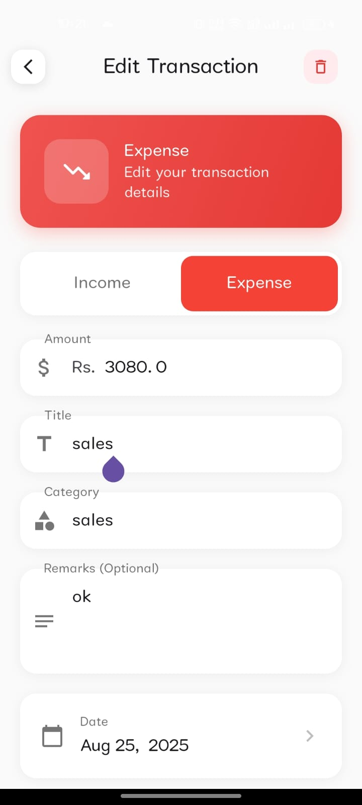

# 💰 BachatSathi - Expense Tracker
![Banner]

A comprehensive expense tracker application that helps you manage your finances effectively with powerful features for tracking expenses, monitoring investments, and generating detailed reports.

---

## ✨ Features

### 💳 Transaction Management
- Add, edit, and delete expenses and incomes  
- Categorize transactions (Food, Rent, Travel, etc.)  
- Advanced filtering by date, category, amount, and more  

<div align="center">
  
  
   
  
</div>

---

### 📊 Budget Management
- Set custom budgets per category  
- Real-time monitoring of spending against budgets  
- Visual alerts when approaching budget limits  

---

### 📈 Financial Visualization
- Interactive charts & graphs for expenses and income  
- Monthly trends analysis  
- Customizable dashboard with key financial metrics  

<div align="center">
  
  
  
</div>

---

### 👥 Party Management
- Track lending/borrowing between different parties  
- Add new parties with contact details  
- Filter and manage party transactions  

<div align="center">
  
  
  
</div>

---

### 📱 Asset Tracking
- Real-time currency, stock, and crypto prices  
- Portfolio tracking for stocks, crypto, and gold  
- Add and manage holdings across different asset classes  

<div align="center">
  
  
  
  
</div>

<div align="center">
  
  
  
  
</div>

<div align="center">
  
  
</div>

---

### 📋 Reporting
- Generate detailed PDF financial reports  
- Customize report parameters and time periods  
- Share reports via email or other platforms  

<div align="center">
  
  
  
</div>

---

### 🔄 Synchronization
- Offline functionality for uninterrupted use  
- Sync data across multiple devices  
- Last sync status tracking  

<div align="center">
  
  
</div>

---

## 🚀 Installation

```bash
# Clone the repository
git clone https://github.com/SUMANKC7/CapstoneProject-BachatSathi-ExpenseTracker-.git

# Open the project in Android Studio
# Build and run the application on your device or emulator
